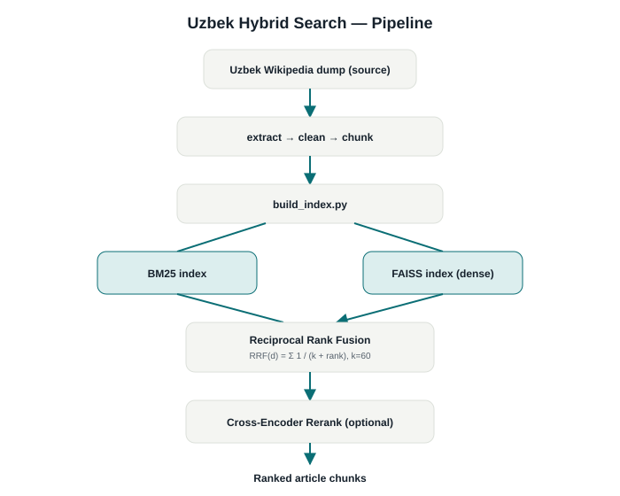

# Uzbek Hybrid Search

**A hybrid information-retrieval engine over Uzbek Wikipedia — BM25 + dense (FAISS) retrieval fused with Reciprocal Rank Fusion, plus optional cross-encoder reranking. Retrieval only; no answer generation.**


[English](README.md) | [O'zbek](README.uz.md)

> **Origin, stated honestly:** this project was built as a structured ML-course module (the internal log/comment references "4.5 — Hybrid RAG", "4.7 — Evaluation", "4.9 — Reranking bonus"), not as an independently conceived side project. The implementation itself is genuine, textbook-correct hybrid IR — verified by direct code review, not just by its file names.

## Description

This is a search engine, not a chatbot: given a query, it returns the most relevant Uzbek Wikipedia article chunks, ranked by fusing a lexical (BM25) and a semantic (dense embedding / FAISS) retriever. There is no LLM in the loop — `evaluate.py` exists to measure retrieval quality directly (Hit Rate@5, F1 against a QA set), which is a different, complementary skill from the RAG *chatbots* elsewhere in this portfolio.

## Features

- BM25 sparse retrieval (`rank_bm25.BM25Okapi`)
- Dense retrieval via `sentence-transformers` embeddings in a FAISS `IndexFlatIP` (cosine similarity via L2-normalized inner product)
- Reciprocal Rank Fusion combining both rankings
- Optional lazy-loaded cross-encoder reranking stage
- A standalone evaluation harness comparing BM25-only, Dense-only, and Hybrid retrieval

## Architecture

See [docs/architecture/pipeline.svg](docs/architecture/pipeline.svg).

```
uzwiki Wikipedia dump (source, not included — see Data below)
    ↓
run_extractor.py → clean_data.py → chunking.py
    ↓
build_index.py  →  BM25 index (rank_bm25)  +  FAISS index (dense embeddings)
    ↓
rag_system.py: UzbekWikiRAG.search()
    ↓
Reciprocal Rank Fusion  →  (optional) Cross-Encoder rerank
    ↓
Ranked article chunks
```

## AI/ML Pipeline

- **Embedding model:** `sentence-transformers/paraphrase-multilingual-mpnet-base-v2`
- **Reranker model:** `cross-encoder/ms-marco-MiniLM-L-6-v2` (lazy-loaded only when `search_reranked()` is called)
- **Fusion:** `RRF(d) = Σ 1/(k + rank)`, `k=60`, combining the top-20 candidates from each retriever
- **Corpus:** a random, seeded sample of 15,000 articles from the Uzbek Wikipedia dump (`N_ARTICLES = 15000`, `RANDOM_SEED = 42` in `config.py`) — not the full ~180k-article dump, due to local compute/RAM constraints noted in the source comments

## Demo



No GUI exists for this project by design (it's a retrieval engine, not a chatbot) — see the pipeline diagram above. An attempt was made to actually execute `demo.py`/`evaluate.py` for this pass to produce a real evaluation chart, but `import sentence_transformers` segfaults in the environment used here (reproduced independently across three separate projects in the same session — an environment issue, not a bug in this code). Combined with `qa_pairs.json` not existing (below), no evaluation output — real or otherwise — is included in this repository.

## Evaluation

`evaluate.py` implements a real comparison harness (Hit Rate@5 and F1, across BM25-only / Dense-only / Hybrid), but **no evaluation has actually been run and persisted** — `qa_pairs.json` (the required question/answer benchmark set) does not currently exist, and no `results.md` was ever generated. This is stated here explicitly rather than presenting invented numbers: **there is no evaluation chart in this repository**, and the Roadmap below lists this as open work.

## Tech Stack

| Layer | Technology |
|---|---|
| Sparse retrieval | rank-bm25 |
| Dense retrieval | sentence-transformers, FAISS (faiss-cpu) |
| Reranking | sentence-transformers CrossEncoder |
| Wikipedia extraction | wikiextractor |

## Data

The source Wikipedia dump (`uzwiki-*.xml`, ~1.3GB) and all generated artifacts (`wiki_output/`, `articles.jsonl`, `chunks.pkl`, `index/`) are **not included in this repository** — they are regenerated locally by running the pipeline scripts below. Download a current Uzbek Wikipedia dump from [dumps.wikimedia.org](https://dumps.wikimedia.org/uzwiki/) before running `run_extractor.py`.

## Installation

```bash
git clone <this-repository>
cd uzbek-hybrid-search
python -m venv venv
source venv/bin/activate  # Windows: venv\Scripts\activate
pip install -r requirements.txt

# 1. Download a uzwiki-*.xml dump into this directory, then:
python run_extractor.py
python clean_data.py
python chunking.py
python build_index.py

# 2. Try it
python demo.py
```

## Project Structure

```
uzbek-hybrid-search/
├── config.py           # corpus size, model names, RRF constant
├── run_extractor.py     # Wikipedia XML → plain text
├── clean_data.py         # text cleaning
├── chunking.py            # chunking into retrieval units
├── build_index.py          # builds BM25 + FAISS indices
├── rag_system.py            # UzbekWikiRAG: search / bm25_search / dense_search / search_reranked
├── evaluate.py               # Hit Rate@5 / F1 comparison harness (not yet run — see Evaluation)
├── demo.py                    # CLI demo
└── requirements.txt
```

## Roadmap

- [ ] Author a `qa_pairs.json` benchmark set and actually run `evaluate.py`, then publish real results
- [ ] Add automated unit tests for the fusion/reranking logic
- [ ] Consider the full ~180k-article dump instead of the 15,000-article sample, given sufficient compute

## License

MIT — see [LICENSE](LICENSE).
